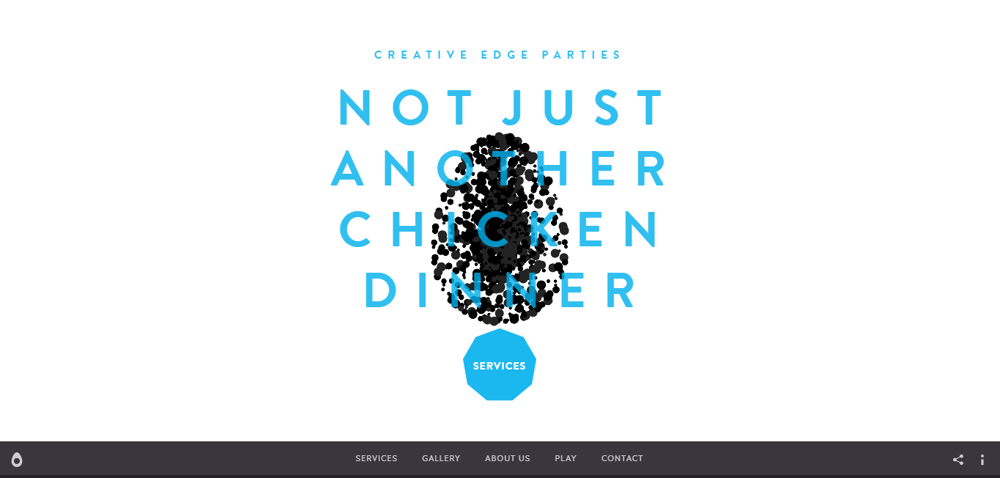
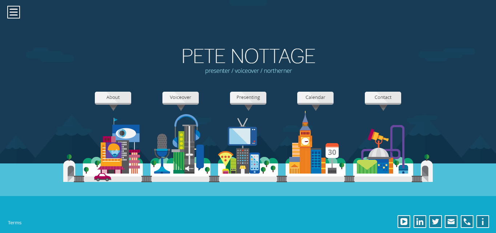

# Open-Sourcing-Adam-Hartwig

> Open Sourcing Adam Hartwig Websites

<h1 align="center"> Open Sourcing Adam Hartwig </h1>

<h2 align="center"> Hacktoberfest 2018 </h2>

<h3 align="center">Let's re-create awesome websites made by Adam.</h3>

## 💻 First Website : 

<h2 align="center">**[adamhartwig.co.uk](http://www.adamhartwig.co.uk/)**</h2>

### Demo : 

----------

## 💻 Second Website : 

<h2 align="center">**[creativeedgeparties.com](http://www.creativeedgeparties.com/)**</h2>

----------

## 💻 Third Website : 

=======
<h2 align="center">**[petenottage.co.uk](https://www.petenottage.co.uk/)**</h2>

